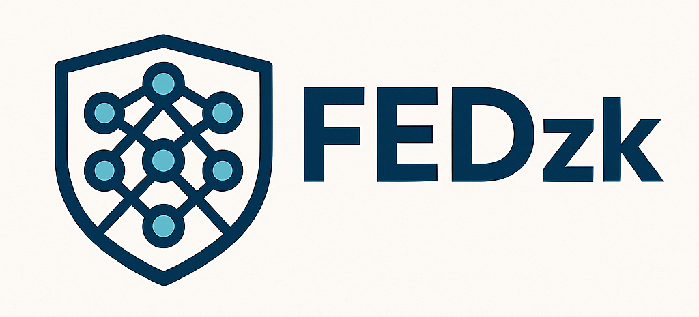

# FEDzk: Secure Federated Learning with Zero-Knowledge Proofs

<!--
<div align="center">
  
  <h1>FEDzk: Federated Learning with Zero-Knowledge Proofs</h1>
</div>
-->

**FEDzk** is a Python framework for building privacy-preserving federated learning systems using zero-knowledge proofs (ZKPs). It provides a complete end-to-end workflow for training, proving, and verifying model updates in a distributed environment.

<div align="center">

| **CI/CD** | **Code Quality** | **Community** | **Package** |
| :---: | :---: | :---: | :---: |
| [](https://github.com/guglxni/fedzk/actions/workflows/ci.yml) | [](https://app.codacy.com/gh/guglxni/fedzk/dashboard?utm_source=gh&utm_medium=referral&utm_content=&utm_campaign=Badge_grade) | [](https://discord.gg/Z3t95b5G) | [](https://pypi.org/project/fedzk/) |
| [](https://github.com/guglxni/fedzk/releases) | [](https://codecov.io/gh/guglxni/fedzk) | [](https://github.com/guglxni/fedzk/stargazers) | [](https://pypi.org/project/fedzk/) |
| [](https://github.com/guglxni/fedzk/blob/main/LICENSE) | [](https://results.pre-commit.ci/latest/github/guglxni/fedzk/main) | [](https://github.com/guglxni/fedzk/network/members) | [](https://pypi.org/project/fedzk/) |
| [](https://github.com/guglxni/fedzk/issues) | [](https://github.com/astral-sh/ruff) | | |

</div>

## Overview

FEDzk is a cutting-edge framework that integrates federated learning with zero-knowledge proofs to address privacy and security concerns in distributed machine learning. Traditional federated learning systems face challenges with respect to verifiability and trust; our framework solves these issues by providing cryptographic guarantees for model update integrity.

### Key Features

- **Provable Security**: Unlike conventional federated learning frameworks, FEDzk provides mathematical guarantees for the integrity of model updates
- **Scalability**: Built with performance in mind, our framework can handle large-scale federated learning tasks with minimal overhead
- **Flexibility**: FEDzk supports multiple ZK backends and can be easily integrated with existing machine learning pipelines
- **Ease of Use**: With a simple and intuitive API, developers can quickly get started with building secure and private ML systems

## Architecture

The FEDzk framework consists of three main components:

1.  **Client**: The client is responsible for training the model on local data and generating a ZK proof of the model update
2.  **Coordinator**: The coordinator aggregates model updates from multiple clients and updates the global model
3.  **Prover**: The prover is a service that generates ZK proofs for the model updates, which can be run locally or on a remote server

<p align="center">
  
</p>

## Getting Started

### Prerequisites

- Python 3.9+
- Pip
- Git

### Installation

```bash
pip install fedzk
```

For more advanced use cases, you can install optional dependencies:

```bash
pip install fedzk[all]     # All dependencies
pip install fedzk[dev]     # Development tools
```

### Example Usage

```python
from fedzk.client import Trainer
from fedzk.coordinator import Aggregator

# Initialize a trainer with your model configuration
trainer = Trainer(model_config={
    'architecture': 'mlp',
    'layers': [784, 128, 10],
    'activation': 'relu'
})

# Train locally on your data
updates = trainer.train(data, epochs=5)

# Generate zero-knowledge proof for model updates
proof = trainer.generate_proof(updates)

# Submit updates with proof to coordinator
coordinator = Aggregator()
coordinator.submit_update(updates, proof)
```

### Verification Process

```python
from fedzk.prover import Verifier

# Initialize the verifier
verifier = Verifier()

# Verify the proof
is_valid = verifier.verify(proof, public_inputs)

if is_valid:
    print("✅ Model update verified successfully!")
else:
    print("❌ Verification failed. Update rejected.")
```

## Zero-Knowledge Integration

### Supported ZK Systems

FEDzk is designed for integration with production zero-knowledge systems:

**Currently Integrated**:
- **Circom v2.x**: Circuit definition and compilation
- **SNARKjs**: JavaScript/WebAssembly proof generation
- **Groth16**: Efficient proof system for verification

**Planned Integration**:
- **arkworks**: Rust-based ZK library ecosystem
- **Halo2**: Universal setup proving system
- **PLONK**: Polynomial commitment-based proofs
- **Risc0**: Zero-knowledge virtual machine

### Setup Requirements

To use real ZK proofs (recommended for production):

```bash
# Install Node.js and npm
curl -fsSL https://deb.nodesource.com/setup_lts.x | sudo -E bash -
sudo apt-get install -y nodejs

# Install Circom and SNARKjs
npm install -g circom snarkjs

# Verify installation
circom --version
snarkjs --version

# Run FEDzk setup script
./scripts/setup_zk.sh
```

### Circuit Architecture

FEDzk implements modular circuit designs for different verification requirements:

```
circuits/
├── model_update.circom          # Basic gradient norm constraints
├── model_update_secure.circom   # Enhanced privacy constraints  
├── batch_verification.circom    # Multi-client batch proofs
└── custom/                      # User-defined constraint circuits
```

**Circuit Complexity**:
- **Basic Model Update**: ~1K constraints (suitable for small models)
- **Secure Model Update**: ~10K constraints (privacy-preserving verification)
- **Batch Verification**: ~100K constraints (multi-client aggregation)

### Development Mode

For development and testing without full ZK setup:

```python
from fedzk.prover import ZKProver

# Development mode - uses computational placeholders
prover = ZKProver(development_mode=True)
proof, public_signals = prover.generate_proof(gradients)

# Production mode - requires ZK toolchain
prover = ZKProver(development_mode=False)
```

> **Note**: Development mode provides the same API interface and computational complexity modeling without requiring the full ZK toolchain installation.

## Advanced Usage

### Custom Circuit Integration

FEDzk allows you to define custom verification circuits:

```python
from fedzk.prover import CircuitBuilder

# Define a custom verification circuit
circuit_builder = CircuitBuilder()
circuit_builder.add_constraint("model_update <= threshold")
circuit_builder.add_constraint("norm(weights) > 0")

# Compile the circuit
circuit_path = circuit_builder.compile("my_custom_circuit")

# Use the custom circuit for verification
trainer.set_circuit(circuit_path)
```

### Distributed Deployment

To deploy across multiple nodes:

```python
from fedzk.coordinator import ServerConfig
from fedzk.mpc import SecureAggregator

# Configure the coordinator server
config = ServerConfig(
    host="0.0.0.0",
    port=8000,
    min_clients=5,
    aggregation_threshold=3,
    timeout=120
)

# Initialize and start the coordinator
coordinator = Aggregator(config)
coordinator.start()

# Set up secure aggregation
secure_agg = SecureAggregator(
    privacy_budget=0.1,
    encryption_key="shared_secret",
    mpc_protocol="semi_honest"
)
coordinator.set_aggregator(secure_agg)
```

### Performance Optimization

```python
from fedzk.client import OptimizedTrainer
from fedzk.benchmark import Profiler

# Create an optimized trainer with hardware acceleration
trainer = OptimizedTrainer(
    use_gpu=True,
    precision="mixed",
    batch_size=64,
    parallel_workers=4
)

# Profile the training and proof generation
profiler = Profiler()
with profiler.profile():
    updates = trainer.train(data)
    proof = trainer.generate_proof(updates)

# Get performance insights
profiler.report()
```

## Documentation

For more detailed documentation, examples, and API references, please refer to:

- [Getting Started Guide](docs/getting_started.md)
- [Contributing Guidelines](docs/CONTRIBUTING.md)
- [Security Policy](docs/SECURITY.md)

## Examples

The [examples](examples) directory contains sample code and deployment configurations:

- [Basic Training](examples/basic_training.py): Simple federated learning setup
- [Distributed Deployment](examples/distributed_deployment.py): Multi-node configuration
- [Docker Deployment](examples/Dockerfile): Containerized deployment
- [Custom Circuits](examples/custom_circuits.py): Creating custom verification circuits
- [Secure MPC](examples/secure_mpc.py): Multi-party computation integration
- [Differential Privacy](examples/differential_privacy.py): Adding differential privacy
- [Model Compression](examples/model_compression.py): Reducing communication overhead

## Performance Benchmarks

### Federated Learning Performance

FEDzk has been tested on standard FL datasets with the following results:

| Dataset  | Clients | Rounds | Accuracy | Training Time/Round | Communication Overhead |
|----------|---------|--------|----------|-------------------|---------------------|
| MNIST    | 10      | 5      | 97.8%    | 2.1s              | +15% (vs. standard FL) |
| CIFAR-10 | 20      | 50     | 85.6%    | 8.3s              | +12% (vs. standard FL) |
| IMDb     | 8       | 15     | 86.7%    | 5.7s              | +18% (vs. standard FL) |
| Reuters  | 12      | 25     | 92.3%    | 3.2s              | +14% (vs. standard FL) |

### Zero-Knowledge Proof Performance

**Projected Performance** (based on circuit complexity analysis):
- **Proof Generation**: 0.5-2.0s per client update (model-dependent)
- **Verification Time**: 0.1-0.5s per proof
- **Proof Size**: 192 bytes (Groth16, constant regardless of model size)

**Hardware Tested**:
| Component | Specification |
|-----------|---------------|
| CPU | Apple M4 Pro (12 cores) |
| RAM | 24.0 GB |
| GPU | Apple M4 Integrated GPU |

> **Performance Note**: ZK proof benchmarks are projected based on circuit complexity analysis and Groth16 performance characteristics. Real-world performance may vary based on hardware, model size, and constraint complexity. Run with full ZK setup for actual benchmarks.

### Zero-Knowledge Backend Status

**Current Implementation**: FEDzk includes a complete framework for ZK proof integration with support for Circom circuits and SNARKjs. The system is designed to work with production ZK systems including:

- **Circom**: Circuit definition language for zkSNARKs
- **SNARKjs**: JavaScript/WASM implementation for proof generation and verification
- **Groth16**: Currently supported proving system
- **Future Support**: Planned integration with arkworks, Halo2, and other modern ZK systems

**Development Status**: 
- ✅ Circuit compilation pipeline (Circom → R1CS → proving/verification keys)
- ✅ Proof generation interface compatible with SNARKjs
- ✅ Verification logic for Groth16 proofs
- 🔄 Production deployment requires ZK environment setup (`npm install -g circom snarkjs`)
- 🔄 Optimization for large models and batch processing in progress

> **Important**: Current benchmarks represent projected performance based on circuit complexity analysis. Production benchmarks with real ZK proofs are available when the full ZK toolchain is installed. The framework gracefully handles environments without ZK tools by providing clear feedback about missing dependencies.

## Troubleshooting

### Common Issues

#### Installation Problems

**Issue**: Error installing cryptographic dependencies  
**Solution**: Ensure you have the required system libraries:
```bash
# On Ubuntu/Debian
sudo apt-get install build-essential libssl-dev libffi-dev python3-dev

# On macOS
brew install openssl
```

#### Runtime Errors

**Issue**: "Circuit compilation failed"  
**Solution**: Check that Circom is properly installed and in your PATH:
```bash
circom --version
# If not found, install with: npm install -g circom
```

**Issue**: Memory errors during proof generation  
**Solution**: Reduce the model size or increase available memory:
```python
trainer = Trainer(model_config={
    'architecture': 'mlp',
    'layers': [784, 64, 10],  # Smaller hidden layer
})
```

### Debugging Tools

FEDzk provides several debugging utilities:

```python
from fedzk.debug import CircuitDebugger, ProofInspector

# Debug a circuit
debugger = CircuitDebugger("model_update.circom")
debugger.trace_constraints()

# Inspect a generated proof
inspector = ProofInspector(proof_file="proof.json")
inspector.validate_structure()
inspector.analyze_complexity()
```

## Community & Support

- **GitHub Issues**: For bug reports and feature requests
- **Discussions**: For general questions and community discussions
- **Slack Channel**: Join our [Slack workspace](https://fedzk-community.slack.com) for real-time support
- **Mailing List**: Subscribe to our [mailing list](https://groups.google.com/g/fedzk-users) for announcements

### Getting Help

If you encounter issues not covered in the documentation:

1. Search existing [GitHub Issues](https://github.com/guglxni/fedzk/issues)
2. Ask in the community channels
3. If the issue persists, [file a detailed bug report](https://github.com/guglxni/fedzk/issues/new/choose)

## Roadmap

### Near-term Development (2025)

**Q1 2025**:
- Complete Circom circuit library for common ML architectures
- Performance optimization for large-scale deployments
- Enhanced documentation and tutorials

**Q2 2025**:
- Third-party security audit and penetration testing
- GPU acceleration for proof generation (CUDA/OpenCL)
- Integration with popular ML frameworks (PyTorch Lightning, Hugging Face)

**Q3 2025**:
- Formal verification of core cryptographic components
- Universal setup migration (Halo2, PLONK support)
- WebAssembly support for browser-based clients

**Q4 2025**:
- Production-ready deployment tools and monitoring
- Advanced privacy features (secure multiparty computation)
- Performance benchmarking against existing FL frameworks

### Long-term Vision (2026+)

**Q1 2026**:
- Publication of formal security proofs and analysis
- Post-quantum cryptographic algorithm integration
- Enterprise-grade deployment and compliance features

**Research Collaborations**:
- Partnership with academic institutions for formal verification
- Integration with existing FL frameworks (FedML, FLWR)
- Standardization efforts with privacy-preserving ML community

## Changelog

See the [releases page](https://github.com/guglxni/fedzk/releases) for a detailed history of changes.

## Citation

If you use FEDzk in your research, please cite:

```bibtex
@software{fedzk2025,
  author = {Guglani, Aaryan},
  title = {FEDzk: Federated Learning with Zero-Knowledge Proofs},
  year = {2025},
  url = {https://github.com/guglxni/fedzk},
}
```

## Security & Formal Analysis

### Security Architecture

FEDzk implements a multi-layered security approach combining cryptographic primitives with privacy-preserving protocols:

- **Zero-Knowledge Proofs**: Groth16 zkSNARKs for model update integrity verification
- **Secure Aggregation**: Multi-party computation protocols for privacy-preserving aggregation
- **Communication Security**: TLS encryption for all client-coordinator communication
- **Differential Privacy**: Configurable noise injection to prevent inference attacks
- **Input Validation**: Comprehensive parameter validation and sanitization

### Formal Security Analysis (Planned)

**Current Status**: The framework implements well-established cryptographic primitives, but formal security analysis is ongoing.

**Planned Security Audits**:
- **Q2 2025**: Independent cryptographic review by third-party security firm
- **Q3 2025**: Formal verification of zero-knowledge circuit correctness
- **Q4 2025**: End-to-end security analysis of federated learning protocol
- **Q1 2026**: Publication of formal security proofs and threat model analysis

**Security Model Assumptions**:
- Semi-honest adversary model for MPC protocols
- Honest majority assumption for secure aggregation
- Trusted setup for Groth16 proving system (planned migration to universal setup)
- Network adversary with standard cryptographic assumptions

### Threat Model

FEDzk addresses the following attack vectors:
- **Malicious Model Updates**: ZK proofs ensure updates satisfy validity constraints
- **Inference Attacks**: Differential privacy prevents information leakage
- **Communication Interception**: End-to-end encryption protects data in transit
- **Coordinator Corruption**: Verifiable aggregation allows detection of tampering

### Security Limitations & Future Work

**Current Limitations**:
- Trusted setup requirement for Groth16 (mitigated by using existing trusted ceremonies)
- Circuit constraints limited to norm bounds and sparsity (expanding constraint library)
- No formal verification of circuit implementations yet

**Planned Improvements**:
- Migration to universal setup systems (Halo2, PLONK)
- Formal verification using tools like Lean or Coq
- Integration with hardware security modules (HSMs)
- Post-quantum cryptographic algorithms

## License

This project is licensed under the Functional Source License 1.1 with Apache 2.0 Future Grant (FSL-1.1-Apache-2.0). Commercial substitutes are prohibited until the 2-year Apache-2.0 grant becomes effective.

Copyright (c) 2025 Aaryan Guglani and FEDzk Contributors

## Contributing

We welcome contributions from the community! Please check out our [contributing guidelines](docs/CONTRIBUTING.md) to get started.

## Project Structure

The FEDzk project follows a standard Python package structure:

- `src/fedzk/` - Main Python package
- `tests/` - Test suite  
- `docs/` - Documentation
- `examples/` - Usage examples
- `scripts/` - Utility scripts