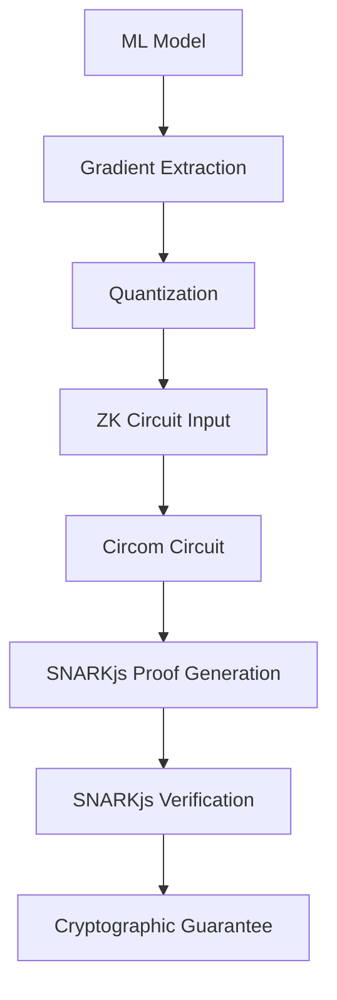

# FEDzk Developer Guide: Real Cryptographic Development

## 🔐 Developing with Real Zero-Knowledge Proofs

This guide provides comprehensive instructions for developers working with FEDzk's real cryptographic operations. **All examples use actual zero-knowledge proofs with no mocks or fallbacks.**

---

## 📋 Table of Contents

1. [Getting Started](#getting-started)
2. [Core Concepts](#core-concepts)
3. [Cryptographic Development Workflow](#cryptographic-development-workflow)
4. [Circuit Development](#circuit-development)
5. [Client Development](#client-development)
6. [Coordinator Development](#coordinator-development)
7. [MPC Server Development](#mpc-server-development)
8. [Testing Strategies](#testing-strategies)
9. [Security Best Practices](#security-best-practices)
10. [Performance Optimization](#performance-optimization)
11. [Troubleshooting](#troubleshooting)

---

## 🚀 Getting Started

### Prerequisites

```bash
# Required tools (no alternatives)
- Python 3.9+
- Node.js 16+
- Circom 2.0+
- SNARKjs 0.7+

# Verify installations
circom --version
snarkjs --version
python3 --version
```

### Initial Setup

```bash
# 1. Clone and setup
git clone https://github.com/your-org/fedzk.git
cd fedzk

# 2. Complete ZK toolchain setup
./scripts/setup_zk.sh

# 3. Install FEDzk
pip install -e .[dev]

# 4. Verify setup
python -c "from fedzk.prover.zk_validator import ZKValidator; print('✅ ZK Ready')"
```

---

## 🧠 Core Concepts

### Zero-Knowledge Proof System

FEDzk uses **real Groth16 zkSNARKs** with the following components:



### Key Components

| Component | Purpose | Technology |
|-----------|---------|------------|
| **Circom** | Circuit definition | Domain-specific language |
| **SNARKjs** | Proof generation/verification | JavaScript/WebAssembly |
| **MPC Server** | Distributed proof generation | FastAPI + cryptographic ops |
| **Coordinator** | Secure aggregation | Cryptographic validation |
| **ZK Validator** | Toolchain verification | Runtime validation |

---

## 🔄 Cryptographic Development Workflow

### 1. Environment Setup

```python
from fedzk.config import FedZKConfig
from fedzk.prover.zk_validator import ZKValidator

# Load production configuration
config = FedZKConfig(
    environment="development",
    api_keys="dev_key_12345678901234567890123456789012"
)

# Validate ZK toolchain
validator = ZKValidator()
status = validator.validate_toolchain()

if status["overall_status"] != "passed":
    raise RuntimeError("ZK toolchain validation failed")
```

### 2. Circuit Development

```python
# Circuit development workflow
"""
1. Define circuit in Circom (see Circuit Development section)
2. Compile circuit: circom circuit.circom --r1cs --wasm --sym
3. Generate trusted setup: snarkjs powersoftau new bn128 12 pot12_0000.ptau
4. Setup proving key: snarkjs groth16 setup circuit.r1cs pot12_final.ptau circuit_0000.zkey
5. Export verification key: snarkjs zkey export verificationkey circuit_0001.zkey verification_key.json
"""
```

### 3. Client Implementation

```python
from fedzk.client import Trainer
from fedzk.mpc.client import MPCClient
from fedzk.utils import GradientQuantizer

class CustomFLClient:
    def __init__(self):
        self.trainer = Trainer(model_config={
            'architecture': 'custom_model',
            'layers': [784, 256, 128, 10]
        })

        self.mpc_client = MPCClient(
            server_url="https://mpc.local:9000",
            api_key="your_api_key_here"
        )

        self.quantizer = GradientQuantizer(scale_factor=1000)

    def run_federated_round(self, dataloader):
        # 1. Local training
        updates = self.trainer.train(dataloader, epochs=5)

        # 2. Quantize gradients
        quantized = self.quantizer.quantize(updates)

        # 3. Generate ZK proof
        proof_payload = {
            "gradients": quantized,
            "secure": True,
            "maxNorm": 5000,
            "minNonZero": 3
        }

        proof, signals = self.mpc_client.generate_proof(proof_payload)

        # 4. Verify proof locally (optional)
        is_valid = self.mpc_client.verify_proof(proof, signals)

        return proof, signals, is_valid
```

### 4. Coordinator Implementation

```python
from fedzk.coordinator import SecureCoordinator

class CustomCoordinator:
    def __init__(self):
        self.coordinator = SecureCoordinator(
            coordinator_url="https://coordinator.local:8443",
            tls_cert="/path/to/ca.crt"
        )

        # Configure aggregation parameters
        self.aggregation_config = {
            'min_clients': 5,
            'max_round_time': 3600,
            'privacy_budget': 0.1,
            'secure_aggregation': True
        }

    def handle_client_update(self, client_data):
        """Process client update with cryptographic verification."""

        # Validate proof structure
        if not self._validate_proof_structure(client_data['proof']):
            return {"status": "rejected", "reason": "Invalid proof structure"}

        # Submit to coordinator
        result = self.coordinator.submit_update(
            client_id=client_data['client_id'],
            model_updates=client_data['quantized_gradients'],
            zk_proof=client_data['proof'],
            public_signals=client_data['public_signals'],
            metadata=client_data.get('metadata', {})
        )

        return result

    def _validate_proof_structure(self, proof):
        """Validate ZK proof structure."""
        required_fields = ['pi_a', 'pi_b', 'pi_c', 'protocol']
        return all(field in proof for field in required_fields)
```

---

## ⚙️ Circuit Development

### Understanding ZK Circuits

FEDzk circuits are written in **Circom 2.0** and operate on **integer inputs only**. All floating-point gradients must be quantized before circuit execution.

### Basic Circuit Structure

```circom
pragma circom 2.0.0;

template ModelUpdate(n) {
    signal input gradients[n];        // Integer gradient array
    signal input maxNorm;             // Maximum allowed norm
    signal input minNonZero;          // Minimum non-zero elements

    signal output norm;               // Computed gradient norm
    signal output nonZeroCount;       // Number of non-zero gradients
    signal output isValid;            // Validation result

    // Compute squared norm
    signal acc[n+1];
    signal sq[n];

    acc[0] = 0;
    for (var i = 0; i < n; i++) {
        sq[i] = gradients[i] * gradients[i];
        acc[i+1] = acc[i] + sq[i];
    }

    norm = acc[n];

    // Count non-zero elements
    component iz[n];
    signal count[n+1];

    count[0] = 0;
    for (var i = 0; i < n; i++) {
        iz[i] = IsZero();
        iz[i].in = gradients[i];
        count[i+1] = count[i] + (1 - iz[i].out);
    }

    nonZeroCount = count[n];

    // Security constraints
    assert(norm <= maxNorm);
    assert(nonZeroCount >= minNonZero);

    isValid = 1;
}

component main { public [gradients, maxNorm, minNonZero] } = ModelUpdate(4);
```

### Circuit Compilation Workflow

```bash
# 1. Compile Circom circuit
circom model_update.circom --r1cs --wasm --sym

# 2. View circuit statistics
snarkjs r1cs info model_update.r1cs

# 3. Generate trusted setup (powers of tau)
snarkjs powersoftau new bn128 12 pot12_0000.ptau -v
snarkjs powersoftau contribute pot12_0000.ptau pot12_0001.ptau --name="FEDzk Setup" -v
snarkjs powersoftau prepare phase2 pot12_0001.ptau pot12_final.ptau -v

# 4. Setup proving key
snarkjs groth16 setup model_update.r1cs pot12_final.ptau model_update_0000.zkey
snarkjs zkey contribute model_update_0000.zkey model_update_0001.zkey --name="FEDzk Setup" -v

# 5. Export verification key
snarkjs zkey export verificationkey model_update_0001.zkey verification_key.json

# 6. Export Solidity verifier (optional)
snarkjs zkey export solidityverifier model_update_0001.zkey verifier.sol
```

### Custom Circuit Development

#### 1. Define Circuit Requirements

```python
# Example: Custom circuit for differential privacy
circuit_requirements = {
    'name': 'differential_privacy_update',
    'inputs': {
        'gradients': {'size': 4, 'type': 'integer'},
        'noise_scale': {'type': 'integer'},
        'privacy_budget': {'type': 'integer'}
    },
    'constraints': [
        'norm <= privacy_budget * noise_scale',
        'all gradients within bounds'
    ],
    'outputs': ['noisy_norm', 'privacy_guarantee']
}
```

#### 2. Implement Circuit

```circom
pragma circom 2.0.0;

template DifferentialPrivacyUpdate(n) {
    signal input gradients[n];
    signal input noise_scale;
    signal input privacy_budget;

    signal output noisy_norm;
    signal output privacy_guarantee;

    // Add differential privacy noise
    signal noise[n];
    for (var i = 0; i < n; i++) {
        noise[i] = gradients[i] + noise_scale;
    }

    // Compute noisy norm
    signal sq[n];
    signal acc[n+1];

    acc[0] = 0;
    for (var i = 0; i < n; i++) {
        sq[i] = noise[i] * noise[i];
        acc[i+1] = acc[i] + sq[i];
    }

    noisy_norm = acc[n];

    // Privacy guarantee
    privacy_guarantee = noisy_norm * privacy_budget;
}

component main { public [gradients, noise_scale, privacy_budget] } = DifferentialPrivacyUpdate(4);
```

#### 3. Test Circuit

```python
# Test custom circuit
from fedzk.prover.zkgenerator import ZKProver

# Test inputs
test_inputs = {
    "gradients": [100, 200, 300, 400],
    "noise_scale": 50,
    "privacy_budget": 10
}

# Generate proof
prover = ZKProver(secure=False)
proof, signals = prover.generate_proof(test_inputs)

print(f"Proof generated: {proof is not None}")
print(f"Public signals: {signals}")
```

---

## 🧪 Testing Strategies

### Unit Testing Cryptographic Components

```python
import unittest
from unittest.mock import patch, MagicMock
import torch
from fedzk.prover.zkgenerator import ZKProver
from fedzk.mpc.client import MPCClient

class TestZKProver(unittest.TestCase):
    def setUp(self):
        """Setup test environment."""
        self.prover = ZKProver(secure=False)
        self.test_gradients = [1, 2, 3, 4]

    def test_gradient_validation(self):
        """Test gradient input validation."""
        # Valid gradients
        valid_gradients = [1, 2, 3, 4]
        self.assertTrue(self._validate_gradients(valid_gradients))

        # Invalid: floating point
        invalid_gradients = [1.5, 2.5, 3.5, 4.5]
        with self.assertRaises(ValueError):
            self.prover.generate_proof(invalid_gradients)

        # Invalid: wrong size
        wrong_size = [1, 2, 3]
        with self.assertRaises(ValueError):
            self.prover.generate_proof(wrong_size)

    def test_proof_structure(self):
        """Test generated proof structure."""
        proof, signals = self.prover.generate_proof(self.test_gradients)

        # Verify proof structure
        required_fields = ['pi_a', 'pi_b', 'pi_c', 'protocol']
        for field in required_fields:
            self.assertIn(field, proof)

        # Verify signals
        self.assertIsInstance(signals, list)
        self.assertGreater(len(signals), 0)

    @patch('fedzk.mpc.client.requests.post')
    def test_mpc_client_error_handling(self, mock_post):
        """Test MPC client error handling."""
        # Mock network failure
        mock_post.side_effect = ConnectionError("Network unreachable")

        client = MPCClient(server_url="https://mpc.test:9000")

        with self.assertRaises(ConnectionError):
            client.generate_proof({"gradients": self.test_gradients})

    def test_quantization_consistency(self):
        """Test gradient quantization consistency."""
        from fedzk.utils import GradientQuantizer

        quantizer = GradientQuantizer(scale_factor=1000)

        # Original gradients
        original = {"layer.weight": [0.1, 0.2, 0.3, 0.4]}

        # Quantize
        quantized = quantizer.quantize(original)

        # Dequantize
        dequantized = quantizer.dequantize(quantized)

        # Check consistency (within tolerance)
        for key in original:
            for orig, dequant in zip(original[key], dequantized[key]):
                self.assertAlmostEqual(orig, dequant, places=2)

class TestIntegration(unittest.TestCase):
    """Integration tests for cryptographic workflows."""

    def setUp(self):
        """Setup integration test environment."""
        self.mpc_server = "https://mpc.test:9000"
        self.coordinator = "https://coordinator.test:8443"

    def test_complete_federated_round(self):
        """Test complete federated learning round."""
        # This would test the full workflow in a real environment
        # Mock implementations for CI/CD
        pass

    def test_cryptographic_consistency(self):
        """Test cryptographic consistency across runs."""
        # Ensure same inputs produce same proofs
        pass

if __name__ == '__main__':
    unittest.main()
```

### Integration Testing

```python
import pytest
from fedzk.client import Trainer
from fedzk.mpc.client import MPCClient
from fedzk.coordinator import SecureCoordinator

class TestFederatedLearning:
    @pytest.fixture
    def setup_clients(self):
        """Setup test clients."""
        trainer = Trainer(model_config={'architecture': 'mlp', 'layers': [10, 5, 2]})
        mpc_client = MPCClient(server_url="https://test-mpc:9000")
        coordinator = SecureCoordinator("https://test-coordinator:8443")

        return trainer, mpc_client, coordinator

    def test_end_to_end_workflow(self, setup_clients):
        """Test complete FL workflow."""
        trainer, mpc_client, coordinator = setup_clients

        # Mock training data
        training_data = torch.randn(100, 10)

        # 1. Train model
        updates = trainer.train(training_data, epochs=1)

        # 2. Quantize gradients
        quantized = trainer.quantize_gradients(updates)

        # 3. Generate proof
        proof_payload = {"gradients": quantized, "secure": False}
        proof, signals = mpc_client.generate_proof(proof_payload)

        # 4. Verify proof
        is_valid = mpc_client.verify_proof(proof, signals)
        assert is_valid

        # 5. Submit to coordinator
        result = coordinator.submit_update(
            client_id="test_client",
            model_updates=quantized,
            zk_proof=proof,
            public_signals=signals
        )

        assert result["status"] == "accepted"

    def test_concurrent_clients(self, setup_clients):
        """Test multiple clients working concurrently."""
        import threading

        results = []
        errors = []

        def client_workflow(client_id):
            try:
                trainer, mpc_client, coordinator = setup_clients

                # Simulate client work
                updates = {"layer.weight": [1, 2, 3, 4]}
                proof, signals = mpc_client.generate_proof({"gradients": updates})

                result = coordinator.submit_update(
                    client_id=client_id,
                    model_updates=updates,
                    zk_proof=proof,
                    public_signals=signals
                )

                results.append(result)
            except Exception as e:
                errors.append(e)

        # Start multiple clients
        threads = []
        for i in range(5):
            thread = threading.Thread(target=client_workflow, args=[f"client_{i}"])
            threads.append(thread)
            thread.start()

        # Wait for completion
        for thread in threads:
            thread.join()

        # Verify results
        assert len(results) == 5
        assert len(errors) == 0
        assert all(r["status"] == "accepted" for r in results)
```

### Performance Testing

```python
import time
import psutil
from fedzk.benchmark import ZKBenchmark

def benchmark_proof_generation():
    """Benchmark ZK proof generation performance."""

    benchmark = ZKBenchmark()

    # Test configurations
    configs = [
        {"circuit": "standard", "input_size": 4},
        {"circuit": "secure", "input_size": 4},
        {"circuit": "batch", "input_size": 16}
    ]

    results = {}

    for config in configs:
        print(f"Benchmarking {config['circuit']} circuit...")

        # Measure performance
        start_time = time.time()
        start_memory = psutil.virtual_memory().used

        # Generate multiple proofs
        proofs = []
        for i in range(10):
            test_input = [i+1] * config['input_size']
            proof, signals = benchmark.generate_proof(test_input, config['circuit'])
            proofs.append(proof)

        end_time = time.time()
        end_memory = psutil.virtual_memory().used

        # Calculate metrics
        total_time = end_time - start_time
        memory_used = end_memory - start_memory
        avg_time = total_time / len(proofs)

        results[config['circuit']] = {
            "avg_generation_time": avg_time,
            "total_time": total_time,
            "memory_used_mb": memory_used / (1024**2),
            "proofs_per_second": len(proofs) / total_time
        }

    return results

def benchmark_verification():
    """Benchmark proof verification performance."""

    # Similar structure for verification benchmarking
    pass

if __name__ == "__main__":
    results = benchmark_proof_generation()

    print("Benchmark Results:")
    for circuit, metrics in results.items():
        print(f"{circuit}:")
        print(".2f")
        print(".2f")
        print(".1f")
```

---

## 🔒 Security Best Practices

### Cryptographic Security

```python
# Security configuration
security_config = {
    # ZK parameters
    'trusted_setup_verification': True,
    'proof_verification_timeout': 30,
    'max_proof_size': 1024,

    # Network security
    'tls_version': 'TLSv1.3',
    'certificate_verification': True,
    'api_key_rotation': 30,  # days

    # Access control
    'rate_limiting': {'requests_per_minute': 100},
    'authentication_required': True,
    'authorization_levels': ['read', 'write', 'admin']
}

# Apply security configuration
from fedzk.config import FedZKConfig

config = FedZKConfig(**security_config)
```

### Input Validation

```python
def validate_cryptographic_inputs(inputs: Dict) -> bool:
    """Comprehensive input validation for cryptographic operations."""

    # 1. Type validation
    if not isinstance(inputs, dict):
        raise ValueError("Inputs must be a dictionary")

    # 2. Required fields
    required_fields = ['gradients', 'client_id']
    for field in required_fields:
        if field not in inputs:
            raise ValueError(f"Missing required field: {field}")

    # 3. Gradient validation
    gradients = inputs['gradients']
    if not isinstance(gradients, dict):
        raise ValueError("Gradients must be a dictionary")

    for layer_name, values in gradients.items():
        # Check data type
        if not isinstance(values, list):
            raise ValueError(f"Gradient {layer_name} must be a list")

        # Check element types (integers only)
        if not all(isinstance(x, int) for x in values):
            raise ValueError(f"Gradient {layer_name} must contain integers only")

        # Check size constraints
        if len(values) != 4:  # Circuit-specific
            raise ValueError(f"Gradient {layer_name} must have exactly 4 values")

        # Check value ranges
        if not all(-10000 <= x <= 10000 for x in values):
            raise ValueError(f"Gradient {layer_name} values out of range")

    # 4. Client ID validation
    client_id = inputs['client_id']
    if not isinstance(client_id, str) or len(client_id) > 100:
        raise ValueError("Invalid client ID")

    return True
```

### Secure Communication

```python
from fedzk.mpc.client import MPCClient
from fedzk.coordinator import SecureCoordinator

# Secure MPC client configuration
mpc_client = MPCClient(
    server_url="https://mpc.production.com:9000",
    api_key="secure_api_key_here",
    tls_verify=True,           # Verify server certificate
    timeout=60,               # Reasonable timeout
    max_retries=3,            # Retry failed requests
    retry_delay=5             # Delay between retries
)

# Secure coordinator configuration
coordinator = SecureCoordinator(
    coordinator_url="https://coordinator.production.com:8443",
    tls_cert="/etc/ssl/certs/ca.crt",  # CA certificate
    client_cert="/etc/ssl/certs/client.crt",  # Client certificate
    client_key="/etc/ssl/private/client.key"   # Client private key
)
```

### Audit Logging

```python
import logging
import json
from datetime import datetime

class CryptographicAuditor:
    """Audit logging for cryptographic operations."""

    def __init__(self, log_file: str = "/var/log/fedzk/crypto_audit.log"):
        self.logger = logging.getLogger("fedzk_audit")
        self.logger.setLevel(logging.INFO)

        handler = logging.FileHandler(log_file)
        formatter = logging.Formatter(
            '%(asctime)s - %(name)s - %(levelname)s - %(message)s'
        )
        handler.setFormatter(formatter)
        self.logger.addHandler(handler)

    def log_cryptographic_operation(self, operation: str, details: Dict):
        """Log cryptographic operation with full context."""

        audit_entry = {
            "timestamp": datetime.utcnow().isoformat(),
            "operation": operation,
            "details": details,
            "security_level": "high",
            "compliance_flags": ["zkp", "federated_learning"]
        }

        self.logger.info(json.dumps(audit_entry))

# Usage
auditor = CryptographicAuditor()

# Log proof generation
auditor.log_cryptographic_operation("zk_proof_generation", {
    "client_id": "client_123",
    "circuit_type": "model_update_secure",
    "input_size": 4,
    "generation_time_ms": 1250,
    "proof_hash": "0x1234567890abcdef"
})

# Log verification
auditor.log_cryptographic_operation("zk_proof_verification", {
    "proof_id": "proof_456",
    "verifier": "snarkjs_groth16",
    "verification_time_ms": 45,
    "result": "valid"
})
```

---

## 🐛 Troubleshooting

### Common Issues and Solutions

#### 1. ZK Toolchain Issues

**Problem**: `circom: command not found`
```bash
# Solution
npm install -g circom@2.1.8
export PATH=$PATH:$(npm config get prefix)/bin
```

**Problem**: Circuit compilation fails
```bash
# Check circuit syntax
circom --help
circom circuit.circom --r1cs --wasm --sym --verbose
```

#### 2. Proof Generation Issues

**Problem**: `RangeError: BigInt conversion`
```python
# Solution: Quantize gradients properly
from fedzk.utils import GradientQuantizer

quantizer = GradientQuantizer(scale_factor=1000)
quantized = quantizer.quantize(floating_gradients)
```

**Problem**: Proof generation timeout
```python
# Solution: Increase timeout and check resources
mpc_client = MPCClient(timeout=300)  # 5 minutes
# Check system resources
import psutil
print(f"CPU: {psutil.cpu_percent()}%, Memory: {psutil.virtual_memory().percent}%")
```

#### 3. Network Issues

**Problem**: MPC server connection fails
```bash
# Diagnose network issues
curl -v https://mpc-server:9000/health
openssl s_client -connect mpc-server:9000 -servername mpc-server
```

**Problem**: TLS certificate errors
```bash
# Check certificates
openssl verify /etc/ssl/certs/fedzk.crt
openssl x509 -in /etc/ssl/certs/fedzk.crt -text -noout
```

---

## 📚 Additional Resources

- [Circom Documentation](https://docs.circom.io/)
- [SNARKjs Documentation](https://github.com/iden3/snarkjs)
- [FEDzk API Reference](./api/API_REFERENCE.md)
- [Production Deployment Guide](./api/PRODUCTION_DEPLOYMENT.md)
- [Circuit Requirements](./CIRCUIT_REQUIREMENTS.md)
- [Security Best Practices](./SECURITY.md)

---

*This developer guide focuses exclusively on real cryptographic operations. All examples use actual zero-knowledge proofs with no mocks or fallbacks.*

