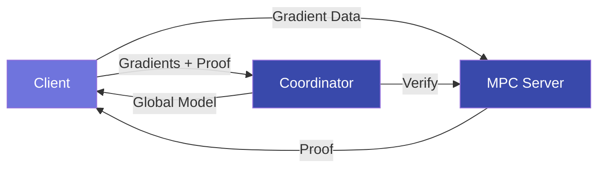

# FedZK Documentation

{ align=right width=150px }

**Privacy-Preserving Verifiable Federated Learning Protocol**

FedZK is an open-source framework that enables federated learning with cryptographic trust guarantees using zero-knowledge proofs. It allows multiple parties to collaboratively train machine learning models without exposing sensitive data while providing verifiable guarantees about model contributions.

!!! info "What is FedZK?"
    FedZK combines federated learning with zero-knowledge cryptography to enable privacy-preserving machine learning across organizations. It ensures that participants follow the protocol without revealing their training data.

## Key Features

- **Privacy-Preserving**: Client data never leaves the local environment
- **Verifiable**: Zero-knowledge proofs ensure protocol compliance
- **Secure Constraints**: Enforcement of gradient norm bounds and sparsity
- **Batch Processing**: Support for large models through batched proofs
- **MPC Integration**: Remote proof generation for resource-constrained clients
- **Comprehensive CLI**: Easy-to-use command-line interface
- **Benchmarking**: Built-in performance measurement tools

## System Architecture

FedZK consists of three main components that work together to enable secure, privacy-preserving federated learning:



1. **Clients**: Train models locally and generate zero-knowledge proofs
2. **Coordinator**: Verifies proofs and aggregates model updates
3. **MPC Server**: Optional component for remote proof generation

!!! tip "Flexible Deployment"
    FedZK can be deployed in various configurations depending on your needs:
    
    - **Standard mode**: Clients generate proofs locally
    - **MPC mode**: Remote server generates proofs for resource-constrained clients
    - **Hybrid mode**: Mix of local and remote proof generation

## Quick Links

- [Getting Started](getting_started.md): Set up and run your first example
- [Architecture](architecture.md): Understand system components and design
- [API Reference](api_reference.md): Comprehensive API documentation
- [Benchmarking](benchmarking.md): Performance evaluation tools
- [Zero-Knowledge Proofs](zk_proofs.md): Details on the cryptographic backend

## Installation

```bash
# Install from PyPI
pip install fedzk

# Or from source
git clone https://github.com/username/fedzk.git
cd fedzk
pip install -e .
```

## Citation

If you use FedZK in your research, please cite:

```bibtex
@software{fedzk2025,
  author = {Guglani, Aaryan},
  title = {FedZK: Secure Federated Learning with Zero-Knowledge Proofs},
  year = {2025},
  url = {https://github.com/aaryanguglani/fedzk}
}
```

## License

FedZK is licensed under the MIT License. See the [LICENSE](https://github.com/username/fedzk/blob/main/LICENSE) file for details. 