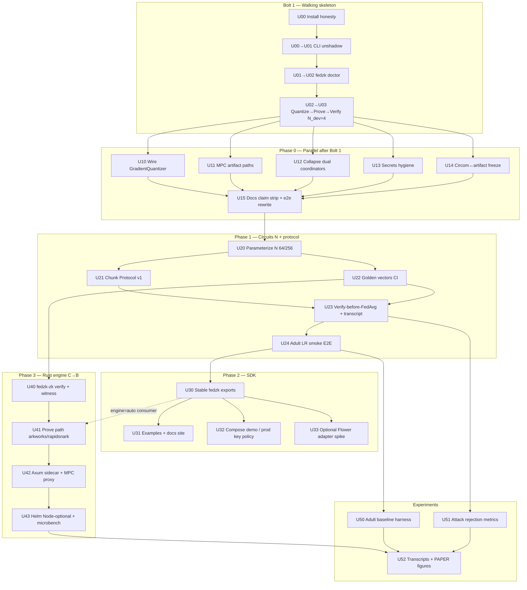

# Contribution: aidlc-architect-agent

**Intent:** `260722-fedzk-contribution`  
**Stage:** inception / units-generation  
**Scope:** Walking skeleton (Bolt 1) + Phase 0–3 implementable units DAG  
**Inputs:** `docs/agent-kit/{architecture,STACK,PLAN,DESIGN,REQUIREMENTS}.html`, `aidlc/spaces/default/memory/project.md`, graphify hubs (prover/zk, coordinator, validation)  
**Date:** 2026-07-22  
**Role:** FEDzk architect — units are construction-ready bolts, not aspirational epics.

---

## ADR summary

### Decision

**Adopt Strategy C → B hybrid** for FEDzk through Phase 3:

| Layer | Lock | Rationale |
|-------|------|-----------|
| Learning / FL loop | Python + PyTorch | Research gravity; Adult/CIFAR experiments stay publishable |
| Integrity policy L | Circom (Groth16 / BN128) | Existing artifacts; changing proving system = product change |
| Prove/verify hot path | Rust `fedzk-zk` (C first), then Axum strangler for prove service (B) | Remove Node/snarkjs from production path without rewriting trainers |
| Wire boundary | `fedzk.proof.v1` (snarkjs-shaped Groth16 JSON) | Language-agnostic contract so Python clients and Rust engines do not fork the protocol |

**Sequence:** Ship **C** (Rust crypto core + dual-verify against snarkjs) as soon as Phase 1 goldens exist; complete **B** (FastAPI MPC façade → Axum prove sidecar, Helm Node-optional) as Phase 3 end-state. Do **not** start Strategy A or D in this intent.

### Alternatives considered (≥2)

| ID | Alternative | Effort (pw) | Why rejected / deferred for this contribution |
|----|-------------|-------------|-----------------------------------------------|
| **A** | Full Rust rewrite (client + coordinator + circuits ecosystem) | 90–160 | Delays paper; breaks PyTorch experiment workflow; out of MVP scope |
| **D** | New proving system / circuit DSL (Noir, Halo2, etc.) | 30–70 | Only justified if N/fidelity is cryptographically blocked; Circom+n parameterization + Chunk Protocol v1 is the first lever |
| **Stay C-only forever** | Python+Circom+snarkjs, no Rust | lower short-term | Acceptable *until* Phase 3 funded; **not** end-state — Node in prod images is the documented weak link |
| **B before C** | Strangle prove HTTP to Axum before arkworks/circom-compat core | 24–45 early | Premature: empty Axum shell without verify/prove parity wastes bolts; C unlocks dual-verify science first |
| **Flower-first SDK** | Make Flower the primary runtime in Phase 2 | medium | v1 = first-party trainer; Flower adapter is optional spike after stable `fedzk` exports |

### ADR consequences (binding on units)

1. Every prove/verify unit must accept/emit **`fedzk.proof.v1`**; engine choice (`rust|snarkjs|auto`) is behind the envelope.
2. Quantizer is a **first-class stage** before witness — no float→snarkjs path.
3. **Single coordinator HTTP surface** (`/v1/...`); dual apps (`aggregator.py` vs `api.py`+`logic.py`) are Phase 0 debt, not a feature.
4. Circuit width `N` is protocol policy (`circuit_id`); silent pad/truncate without Chunk Protocol v1 is anti-architecture.
5. Compliance modules stay off the critical path until G1–G4 crypto honesty lands.

---

## Units DAG

### Legend

- **Bolt 1** = walking skeleton (serial gate before swarm).
- **P0-*** = Phase 0 hygiene (parallelizable after Bolt 1 where noted).
- **P1-*** = Phase 1 circuits & protocol.
- **P2-*** = Phase 2 SDK / packaging.
- **P3-*** = Phase 3 Rust engine (Strategy C→B).
- **EXP-*** = experiments (overlap Phase 1–4; scheduled after goldens).

### Mermaid



### Numbered dependency list (construction order)

| Unit | Title | Depends on | Parallel with | Phase exit contribution |
|------|-------|------------|---------------|-------------------------|
| **U00** | Install honesty: version/license metadata, importable `fedzk`, no hard torch fail at import for non-train paths | — | — | Bolt 1 start |
| **U01** | **CLI shadow fix**: resolve `fedzk.cli` package vs `cli.py`; export Typer `app`; `fedzk --help` works | U00 | — | Entrypoint |
| **U02** | `fedzk doctor`: toolchain + artifact sha256 checks | U01 | — | Hygiene sensor |
| **U03** | Walking skeleton: quantize → prove → verify length **N_dev=4** via CLI + one Python snippet matching DESIGN | U02 | — | **Bolt 1 gate** |
| **U10** | Wire `GradientQuantizer` into `ZKProver` / MPC client / CLI prove | U03 | U11, U12, U13, U14 | FR quantize path |
| **U11** | Fix MPC/prove default artifact paths to shipped wasm/zkey/vkey | U03 | U10, U12… | FR-ART-01 |
| **U12** | Collapse dual coordinators → single app (`api.py`+`logic.py`); deprecate `/submit_update` alias | U03 | U10, U11… | FR-CRD-01 |
| **U13** | Untrack `secrets/`; gitleaks; prod mode refuses untrusted keys | U03 | U10… | SEC hygiene |
| **U14** | Circom source ↔ artifact sync: regenerate **or** freeze + document | U03 | U10… | Artifact honesty |
| **U15** | Strip false “production-ready / 100% tested”; rewrite e2e to real `/v1` APIs | U10–U14 | — | **Phase 0 exit** |
| **U20** | Parameterize circuits `N∈{64,256}`; `circuit_id` = `model_update_{quantized\|secure}@N` | U15 | — | Capacity |
| **U21** | Chunk Protocol v1 + commitment binding in public signals | U20 | U22 | Honest capacity |
| **U22** | Golden vectors CI per `circuit_id` (snarkjs baseline) | U20 | U21 | Crypto CI |
| **U23** | Coordinator: structural `ProofValidator` → crypto verify → `VerifiedUpdate` → FedAvg; transcript events | U21, U22 | — | Verify-before-aggregate |
| **U24** | Adult LR few-round smoke E2E green | U23 | — | **Phase 1 exit** |
| **U30** | Stable public SDK: `LocalTrainer`, `GradientQuantizer`, `ZKProver`, `ZKVerifier`, `CoordinatorClient` | U24 | — | DESIGN §1 |
| **U31** | Examples in CI + mkdocs/docs site snippets that import | U30 | U32, U33 | Docs honesty |
| **U32** | docker-compose demo; prod profile no default test keys | U30 | U31, U33 | Deploy honesty |
| **U33** | Optional Flower adapter spike (non-blocking for Phase 2 exit) | U30 | U31, U32 | Integration option |
| **U40** | `fedzk-zk`: witness + **verify**; golden cross-check vs snarkjs | U22 | may start after U22, before U24 | Strategy **C** start |
| **U41** | Prove path (arkworks or rapidsnark FFI); `FEDZK_ZK_BACKEND=auto\|rust\|snarkjs` | U40 | — | Prove parity |
| **U42** | Axum prove sidecar; MPC FastAPI proxies to it | U41 | — | Strategy **B** |
| **U43** | Helm Node-optional; paper microbench snarkjs vs Rust | U42 | — | **Phase 3 exit** |
| **U50** | Adult baseline vs FEDzk experiment harness | U24 | U51 | Paper data |
| **U51** | Attack rejection suite metrics (malicious out-of-bound updates) | U23 | U50 | Integrity evidence |
| **U52** | Open transcripts + PAPER figures/tables | U50, U51, U43 | — | Research deliverable |

### Parallelism rules (swarm)

1. **Do not swarm before U03** (Bolt 1). CLI shadow + doctor + N=4 quantized prove/verify is the shared spine.
2. After Bolt 1: **U10–U14** may run in parallel; **U15** is the Phase 0 merge gate.
3. **U40** may start as soon as **U22** goldens exist (Rust verify-first), overlapping U23–U24 — but must not change `fedzk.proof.v1`.
4. **U33** must not block Phase 2 exit; Flower is optional.
5. Compliance/ISO modules: **explicitly excluded** from this DAG (AGENTS forbidden list / PLAN risk register).

---

## Interfaces / contracts per unit

### Global contracts (all units)

#### `fedzk.proof.v1` (proof wire)

```json
{
  "schema": "fedzk.proof.v1",
  "protocol": "groth16",
  "curve": "bn128",
  "circuit_id": "model_update_secure@4",
  "proof": {
    "pi_a": ["...", "...", "..."],
    "pi_b": [["...", "..."], ["...", "..."], ["...", "..."]],
    "pi_c": ["...", "...", "..."],
    "protocol": "groth16",
    "curve": "bn128"
  },
  "public_signals": ["..."],
  "meta": {
    "scale_bits": 12,
    "chunk_index": 0,
    "chunk_count": 1,
    "round_id": "r-0001",
    "n": 4
  }
}
```

- **Compatibility:** snarkjs-shaped Groth16 JSON; major bump only if field layout breaks.
- **Owners:** U03 (introduce), U10 (meta.scale_bits mandatory), U21 (chunk fields), U40–U41 (Rust parse/emit identical).

#### Quantize contract

| Field | Type | Notes |
|-------|------|-------|
| Input | float tensor / list | From `LocalTrainer` or CLI `--input` |
| Output `q_grads` | `list[int]` length ≤ N (or chunked) | Field elements as decimal strings in witness |
| `meta.scale_bits` | int | Default 12 in DESIGN examples |
| Errors | `QuantizationError`, `CircuitInputError` | Never prove on raw floats |

Module: `fedzk.zk.input_normalization.GradientQuantizer` — **must be called** inside `ZKProver.prove` before witness (U10), not only in docs.

#### Coordinator API contract (single surface — U12)

| Method | Path | Contract |
|--------|------|----------|
| POST | `/v1/rounds/{round_id}/updates` | Body: `{client_id, gradients\|chunk_refs, proof\|proofs, public_signals\|envelope, meta}` → verify-before-store |
| GET | `/v1/model` | `{model_version, weights, circuit_id, scale_bits, bounds}` |
| GET | `/health` | Liveness |
| GET | `/ready` | Artifacts + vk loaded |
| POST | `/submit_update` | **Deprecated alias** one minor version only |

Pipeline (normative): rate-limit → `ProofValidator` (structural) → crypto verify (`ZKVerifier` / `fedzk-zk`) → `VerifiedUpdate` → on threshold FedAvg → bump `model_version` → transcript event.

#### Prove service contract (U11 now FastAPI; U42 Axum)

| Method | Path | Body |
|--------|------|------|
| POST | `/v1/prove` | `{circuit_id, input, meta?}` → `fedzk.proof.v1` |
| POST | `/v1/verify` | `{circuit_id\|vk_id, proof, public_signals}` → `{valid: bool}` |

### Per-unit interface checklist

| Unit | Exposes | Consumes | Acceptance sensor |
|------|---------|----------|-------------------|
| **U01** | `fedzk.cli:app` (Typer); console_scripts `fedzk` | packaging metadata | `fedzk --help`, `fedzk doctor --help` |
| **U02** | Doctor report JSON/text: node/circom/snarkjs optional, artifact hashes | artifact manifest | Non-zero exit if wasm/zkey/vkey missing or hash mismatch |
| **U03** | CLI `prove`/`verify` for N=4; DESIGN snippet imports | Quantizer stub OK if wired enough for ints | Prove/verify round-trip on golden length-4 vector |
| **U10** | `ZKProver.prove(q_grads, meta)`; rejects floats | `GradientQuantizer.encode` | Unit test: float input without encode fails; encode→prove succeeds |
| **U11** | Default paths under shipped package data | content-addressed sha256 | `fedzk doctor` green on fresh clone |
| **U12** | One FastAPI app; `CoordinatorClient` → `/v1/...` | `VerifiedUpdate`, validators | e2e hits `/v1/rounds/.../updates`, not fictional APIs |
| **U13** | gitleaks CI; prod key policy | env `FEDZK_ENV=prod` | Secrets not in git; prod refuses labeled-untrusted zkeys |
| **U14** | Manifest: `circuit_id → {wasm,zkey,vkey,sha256}` | circom sources | Document “frozen” vs “regenerate in CI” |
| **U20** | Circom templates parameterized by N; Python `max_inputs=N` | ceremony/artifacts for each N | Prove length-64 smoke (dev keys OK) |
| **U21** | Chunk encoder/decoder; commitment in public signals | N from U20 | Multi-chunk update accepted iff all π verify + commitment matches |
| **U22** | `tests/golden/{circuit_id}/*` | snarkjs | CI job both engines later; snarkjs required now |
| **U23** | Transcript event schema `{round_id, client_id, proof_hash, accepted}` | U12 API | Reject invalid π; aggregate only verified |
| **U24** | Experiment config `adult-lr-fedzk.yaml` | U23 | Few rounds green in CI (timeout-bounded) |
| **U30** | `__init__.py` public exports per DESIGN | U10–U24 | `from fedzk import ...` matches docs |
| **U40** | `fedzk-zk verify` CLI/HTTP; parse `fedzk.proof.v1` | U22 goldens | Bit-identical valid/invalid vs snarkjs on goldens |
| **U41** | Prove via Rust; `engine=auto` | U40 | Feature flag; fallback snarkjs |
| **U42** | Axum `/v1/prove|/v1/verify`; MPC proxy | U41 | Compose: coordinator + rust prove, no Node in prove image |
| **U50–U52** | Metrics tables, open transcripts | U23–U24, U43 | Reproducible from tagged commit |

### Brownfield debt mapped into units (must not be “forgotten”)

| Debt (project.md / AGENTS) | Owning unit |
|----------------------------|-------------|
| CLI package shadows `cli.py` | **U01** |
| torch optional but hard-imported | **U00** (lazy import / optional extra) |
| n=4 circuits only | **U03** keep as N_dev; **U20** expand |
| Quantizer unwired | **U10** |
| MPC artifact path defaults wrong | **U11** |
| Dual coordinators; fictional e2e APIs | **U12**, **U15** |
| 223 secrets tracked | **U13** |

---

## Diary

### Interpretations

1. **Walking skeleton ≠ full Phase 0.** Bolt 1 is the minimum honest loop: install → unshadowed CLI → doctor → quantized prove/verify at **N=4**. Parallel Phase 0 units then remove the lying surfaces (dual coordinators, bad paths, secrets, marketing claims).
2. **N=4 is a feature of Bolt 1, not a failure.** PLAN exit gate explicitly allows N_dev=4; capacity honesty comes in U20–U21. Agents must not “pad silently” to fake larger N.
3. **Strategy C→B is a dependency arrow, not a fork.** U40–U41 (C) unlock scientific dual-verify; U42–U43 (B) remove Node from deploy topology. SDK (`engine=auto`) is the strangler seam.
4. **Single coordinator is a protocol concept**, not a cleanup nicety. Dual schemas break `CoordinatorClient` and CONCEPTS “one protocol ⇒ one HTTP schema.”
5. **Quantizer is on the architecture critical path.** Without U10, the SNARK layer remains conceptually disconnected from ML tensors (architecture.html rationale).
6. **Units generation DAG is the PLAN phases made bolt-sized.** Phase 4–5 exist in PLAN but are only lightly represented here as EXP + release deferred to later inception/construction stages (mvp primary scope).

### Deviations

1. **Flower adapter (U33) is non-gating** vs a strict reading of “Phase 2 complete.” Aligns with STACK: v1 first-party trainer; Flower is v1.1 optional.
2. **Rust verify (U40) may overlap Phase 1** after goldens (U22), slightly ahead of PLAN’s “Phase 3 after Phase 2” cartoon — justified by STACK “do C first” and dual-verify needing goldens, not packaging.
3. **Compliance / ISO / “enterprise” modules intentionally omitted** from the DAG despite existing code hubs — PLAN risk “scope creep (compliance)” and architecture “demote compliance until G1–G4.”
4. **Aggregator deletion vs archive:** U12 prefers archive/deprecate alias over hard-delete in the same bolt if external demos still call `/submit_update`; hard-delete allowed once U15 e2e is green.

### Tradeoffs

| Tradeoff | Choice | Cost | Benefit |
|----------|--------|------|---------|
| Keep Circom vs Strategy D | Keep | Stuck with Groth16/R1CS limits | No crypto product rewrite; reuse artifacts |
| snarkjs fallback forever vs Rust-only | `engine=auto` | Two prove paths to maintain | CI dual-verify; safe rollback |
| HTTP/UDS to Rust vs PyO3 first | HTTP/UDS first | Extra hop latency | Clear process boundary; matches Axum B |
| Parallel Phase 0 vs serial safety | Parallel U10–U14 | Merge conflicts on prover/CLI | Faster Phase 0 exit; Bolt 1 already stabilized CLI |
| In-memory coordinator v1 vs Redis | In-memory for demos | No multi-node durability | Matches architecture v1; persistence = v1.1+ |
| N=256 prove cost | Chunking + honest reporting | Paper must show overhead | Avoids silent truncation (P4) |

### Open questions

1. **Ceremony ownership:** Who regenerates zkeys for N=64/256 (U20), and are they labeled `untrusted-dev` until a real MPC ceremony? (Blocks prod profile claims in U32.)
2. **Prove backend pick for U41:** arkworks prove vs rapidsnark FFI first if zkey import fails — time-box per PLAN risk register; needs explicit spike owner.
3. **Chunk commitment hash domain:** Poseidon-in-circuit vs SHA256 outside + bind in public signals — must be fixed before U21 ships goldens.
4. **Torch optional story (U00):** Is `fedzk[train]` extra enough, or must core install include a no-torch coordinator-only profile for prove workers?
5. **Duplicate coordinator code volume:** Prefer move-and-shim (U12) or rewrite e2e first (U15) if `aggregator.py` still has unique FedAvg quirks — reverse-engineering pass should answer before construction swarm.
6. **N_dev in CI:** Keep permanent N=4 fast job after U20, or migrate all CI to N=64 with longer timeouts?
7. **Intent scope boundary:** Confirm Phase 5 (SBOM, signed release, v1.0.0 tag) stays out of this units DAG until scope promotes from `mvp` → `feature`/`enterprise` (project.md).

---

## Traceability (requirements IDs)

| Unit cluster | REQUIREMENTS.html |
|--------------|-------------------|
| U02, U11, U14 | FR-ART-01 |
| U10, U03 | Quantize / prove path (FR prover family) |
| U12, U23 | FR-CRD-01 |
| U13 | SEC-* secrets / key policy |
| U22, U40 | NFR crypto CI / dual-verify |
| U24, U50–U52 | RS-* experiment / paper |

---

## Handoff notes for construction

- **First PR theme:** U01 → U02 → U03 only; do not mix coordinator collapse in Bolt 1.
- **Swarm-safe after U03:** U10, U11, U12, U13, U14 on separate branches with contract tests against `fedzk.proof.v1` fixtures.
- **Architecture anti-goals remain binding:** no float→snarkjs; no dual coordinator schemas; no silent truncate; no import-time hard-fail if snarkjs missing (lazy + explicit engine init).

*End of aidlc-architect-agent contribution — units-generation.*
